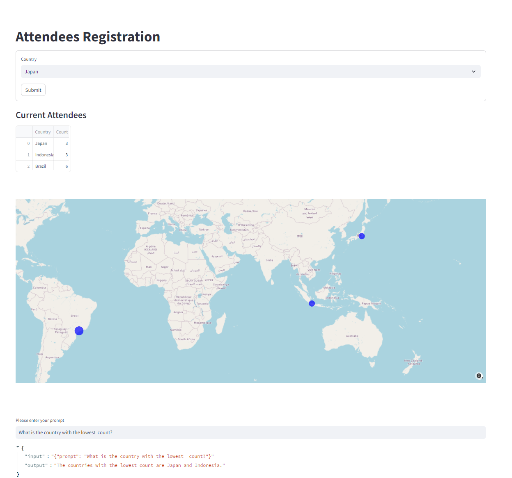

# Attendees Registration and Analysis Tool

This tool is a web application built with Streamlit that allows for the registration of event attendees, aggregation of their data, and visualization of attendee distribution on a global map. Additionally, it integrates with OpenAI's language model to provide insights based on the collected data.

## Features

1. **Initialization and Data Handling**:
   - Checks for the existence of a CSV file (`attendees.csv`) and creates it if it doesn't exist.
   - Appends new attendee data to the CSV file, updating counts for each country.
   - Loads world cities data from a CSV file to provide country selection options and geographical coordinates.

2. **User Interface**:
   - Provides a form for users to select their country from a dropdown list and submit their registration.
   - Displays a success or error message based on the form submission.

3. **Data Display**:
   - Shows the current attendee data from the CSV file in a table format within the app.
   
4. **Data Visualization**:
   - Merges attendee data with world cities data to obtain latitude and longitude information.
   - Aggregates coordinates for each country and displays a scatter map using Plotly. The size of the points on the map corresponds to the number of attendees from each country.

5. **Interactive Data Analysis**:
   - Integrates with LangChain and OpenAI to create an agent that can answer user queries based on the attendee data.
   - Provides a text input for users to ask questions, and displays the agent's response.

## Implementation Details

- **Libraries Used**:
  - `streamlit`: For building the web application interface.
  - `pandas`: For data manipulation and CSV handling.
  - `plotly.express`: For data visualization and map plotting.
  - `langchain`: For creating a data analysis agent using OpenAI's models.
  - `openai`: For accessing OpenAI's language models.

- **Key Functions**:
  - `initialize_csv(filename='attendees.csv')`: Ensures the CSV file exists and initializes it with the appropriate columns.
  - `append_to_csv(country, filename='attendees.csv')`: Adds or updates the attendee count for a given country.
  - `load_data(file_path)`: Loads data from a specified CSV file.
  
- **Streamlit Components**:
  - `st.title()`: Sets the title of the app.
  - `st.form()`: Creates a form for user input.
  - `st.selectbox()`: Provides a dropdown list of countries.
  - `st.form_submit_button()`: Adds a submit button to the form.
  - `st.success()`, `st.error()`: Display messages based on form submission status.
  - `st.subheader()`, `st.write()`: Display the attendee data table.
  - `st.plotly_chart()`: Displays the interactive map.
  - `st.text_input()`: Provides a text input for user queries.

## How to Use

1. **Register Attendees**:
   - Select a country from the dropdown list.
   - Click the "Submit" button to register the attendee.
   
2. **View Attendee Data**:
   - The current list of attendees is displayed in a table.
   
3. **Visualize Attendee Distribution**:
   - The global map shows the distribution of attendees, with point sizes representing the number of attendees from each country.
   
4. **Analyze Data with AI**:
   - Enter a query in the text input field to ask questions about the data, such as "What is the country with the highest count?".
   - The response from the AI agent is displayed below the input field.

This tool combines data collection, visualization, and AI-driven analysis to provide a comprehensive solution for managing and understanding event attendee data.

